# MedConnect: DFU Detect

AI-powered diabetic foot ulcer (DFU) assessment for image-based wound analysis, segmentation, and classification in a cross-platform Flutter application.

DFU Detect is designed for healthcare and research workflows that need a fast, intuitive way to acquire wound images, analyze them with deep learning models, and present clinically relevant outputs such as ulcer segmentation masks, severity classification, and confidence-based insights. The app is built to support mobile-first deployment while remaining compatible with broader healthcare and research environments.

[](https://flutter.dev)
[](https://dart.dev)
[](https://flutter.dev)
[]()
[](LICENSE)

## Overview

This application combines modern mobile UI patterns with medical image analysis to support clinicians, researchers, and healthcare teams in evaluating diabetic foot ulcers. It supports both live camera capture and file upload, sends requests to an AI backend for analysis, and visualizes the result in a clinically interpretable manner.

The platform is structured around a simple but powerful workflow:

1. Capture or upload a wound image.
2. Validate and prepare the image for analysis.
3. Send the image to a segmentation and classification pipeline.
4. View visual overlays, prediction labels, and supporting metadata.
5. Use the output as an assistive clinical reference, not a standalone diagnosis.

---

## Key Features

### AI and Medical Imaging Capabilities

- Computer vision-based segmentation of diabetic foot ulcers from uploaded or camera-captured images.
- Multi-class classification for wound severity, tissue type, or ulcer-related categories.
- Prediction confidence reporting to support interpretability and human review.
- Image preprocessing and validation before inference.
- REST API integration for backend-based AI inference and model deployment.

### Mobile App Functionality

- Native-looking Flutter UI for Android, iOS, and web.
- Camera capture flow with guided acquisition support.
- Gallery/file upload support for existing wound images.
- Review screen before analysis to confirm image selection.
- Real-time or batch upload progress feedback.
- Results presentation with overlay visualization and classification output.
- Clean, clinician-friendly interface suitable for research and assistive diagnostics workflows.

---

## System Architecture / How It Works

The application follows a streamlined medical AI pipeline that separates user interaction from model execution.

```mermaid
flowchart LR
    A[User opens app] --> B[Capture image or upload file]
    B --> C[Client-side validation]
    C --> D[Send request to AI backend]
    D --> E[Preprocessing + segmentation model]
    E --> F[ROI refinement / tissue analysis]
    F --> G[Classification model]
    G --> H[Display mask overlay + result summary]
    H --> I[Clinical review / report generation]
```



### Pipeline Overview

1. Image Acquisition
   - The user captures an image using the device camera or selects a file from local storage.
   - The app validates the selected file type and basic image quality constraints.

2. Upload and Backend Processing
   - The Flutter app sends the image to a Python backend or AI service using REST APIs.
   - The backend handles preprocessing and runs the deep learning pipeline.

3. Segmentation Stage
   - The model identifies the ulcer region and produces a mask or overlay highlighting the wound boundary.

4. Classification Stage
   - The cropped or refined region is passed to a classification model to estimate severity, tissue category, or ulcer stage.

5. Results Visualization
   - The app renders the original image together with segmentation overlays and the final classification label, confidence, and metadata.

---

## Tech Stack & Dependencies

| Layer | Technology | Purpose |
| --- | --- | --- |
| Frontend | Flutter + Dart | Cross-platform mobile and web application development |
| Camera & Imaging | camera, image_picker, file_picker | Live capture and local image access |
| HTTP / API | Dio | Uploading images and communicating with backend services |
| State Management | Flutter built-in state + custom app logic / Provider-ready patterns | UI state and workflow orchestration |
| AI Backend | Python + FastAPI | REST API layer, preprocessing, model orchestration |
| ML Runtime | PyTorch / ONNX / TensorFlow Lite (depending on deployment) | Segmentation and classification inference |
| Inference Deployment | REST API backend or edge model serving | Model execution outside the mobile UI layer |
| Build Tooling | Flutter SDK, Android Studio, Xcode | Native platform builds |

### Core Dependencies

```yaml
dependencies:
  flutter:
    sdk: flutter
  camera: ^0.11.2+1
  dio: ^5.9.0
  file_picker: ^10.3.3
  image_picker: ^1.2.1
  cupertino_icons: ^1.0.8
```

> This app is intentionally structured so that the heavy AI workloads remain outside the UI layer, improving performance, maintainability, and deployment flexibility.

---

## Getting Started / Installation Guide

### Prerequisites

Before running the app, make sure you have the following installed:

- Flutter SDK 3.13.x or newer
- Dart SDK compatible with the Flutter version
- Android Studio or VS Code with Flutter extension
- Xcode for iOS development on macOS
- An active backend service for AI inference if the model runs server-side

### 1. Clone the repository

```bash
git clone https://github.com/saharfeki/dfu-wound-segmentation-classification/edit/main/dfu_app.git
cd dfu-detect
```

### 2. Install Flutter dependencies

```bash
flutter pub get
```

### 3. Run the application

```bash
flutter run
```

For a specific device or emulator:

```bash
flutter devices
flutter run -d <device-id>
```

### 4. Backend setup (if using REST AI service)

If your AI pipeline runs on a backend server, start the service before testing image upload or inference.

Example:

```bash
cd ../backend
python -m venv .venv
source .venv/bin/activate  # Windows: .venv\Scripts\activate
pip install -r requirements.txt
python -m uvicorn main.main:app --host 127.0.0.1 --port 8000
```

Then launch the Flutter app and confirm the backend endpoint is reachable.

### 5. Production builds

Android:

```bash
flutter build apk
```

iOS:

```bash
flutter build ios
```

Web:

```bash
flutter build web
```

---

## Model Details 

This project is built around a wound-analysis pipeline that can combine segmentation and classification models for DFU assessment. The exact model configuration may vary depending on the training setup and deployment target.

### Typical Model Configuration

| Aspect | Example Configuration |
| --- | --- |
| Task | DFU segmentation and classification |
| Input resolution | 512x512 or 1024x1024 RGB image |
| Model type | Encoder-decoder segmentation network + classifier |
| Output | Wound mask, severity/class label, confidence score |
| Inference mode | Server-side REST API or optimized on-device model |
| Data format | JPEG/PNG image input |


### Model Reporting Guidance

For production deployment and research publication, record the following metrics for each trained model:

- Dice coefficient / F1 score for segmentation
- IoU / mIoU for wound region mask accuracy
- Accuracy, precision, recall, and F1 for classification
- Per-class metrics for severity or tissue labels
- Inference latency and memory footprint

> Final metrics should be updated from actual validation runs and training checkpoints before release in a clinical or research context.

---

## Project Structure

```text
dfu_app/
├── android/                 # Android project files
├── ios/                     # iOS project files
├── lib/                     # Flutter application source code
│   ├── main.dart            # App entry point and core UI setup
│   ├── models/              # Data models for analysis results
│   ├── services/            # API service and processing logic
│   ├── screens/             # Feature screens and navigation flows
│   ├── widgets/             # Reusable UI components
│   ├── utils/               # Helpers, validators, and utilities
│   └── theme/               # Style and theme configuration
├── test/                    # Widget and unit tests
├── web/                     # Web build assets
├── windows/                 # Windows build configuration
├── linux/                   # Linux build configuration
├── macos/                   # macOS build configuration
├── analysis_options.yaml    # Linting and analysis configuration
├── pubspec.yaml             # Flutter package configuration
├── README.md                # Project documentation
├── .gitignore               # Git ignore rules
├── contextDFU/              # Project planning and domain context
│   ├── overview.md
│   ├── architecture.md
│   ├── ai_workflow.md
│   └── features/
└── ...
```
 
---

## Disclaimer

This application is intended for research, educational, and assistive clinical use only. It is not a substitute for professional medical judgement, diagnosis, or treatment planning.

Diabetic foot ulcer assessment requires qualified clinical evaluation, patient history review, and professional medical decision-making. The outputs of this application should be interpreted as supporting information only and must not be used as the sole basis for medical diagnosis or treatment recommendations.

---

## License

This project is licensed under the MIT License. 
```

## Summary

DFU Detect demonstrates how a modern Flutter application can integrate image acquisition, deep learning-based wound analysis, and clear clinical result presentation in a single workflow. It is designed to be extensible, developer-friendly, and aligned with the needs of healthcare AI applications in the diabetic wound assessment domain.
